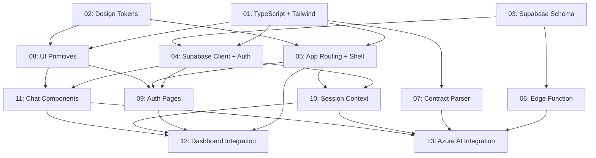

# Contract Assistant

## Overview

A multi-user AI-powered contract assistant built on React + TypeScript, Supabase, and Azure AI Foundry. Users sign in, create chat sessions, upload a contract once per session (PDF or TXT, parsed client-side), and then chat with an Azure AI Foundry Agent about that contract. Multiple sessions persist in a left sidebar. Contract text is stored in Supabase and sent to the Azure AI thread only on the first message per session — never again — to minimize token usage.

## Quick Links

- [Requirements](./requirements.md) — full requirements and acceptance criteria
- [Action Required](./action-required.md) — manual steps needing human action

## Dependency Graph

## Waves

| Wave | Tasks | Description |
|------|-------|-------------|
| 1 | task-01, task-02, task-03 | Project foundation: TypeScript migration, design token CSS, Supabase schema SQL |
| 2 | task-04, task-05, task-06, task-07, task-08 | Infrastructure layer: auth context, app shell, edge function, contract parser, UI primitives |
| 3 | task-09, task-10, task-11 | Feature components: auth pages, session management, chat UI |
| 4 | task-12, task-13 | Final integration: dashboard wiring, Azure AI live connection |

## Task Status

### Wave 1
- [x] [task-01-typescript-tailwind](./tasks/task-01-typescript-tailwind.md) — Convert to TypeScript and configure Tailwind CSS
- [x] [task-02-design-tokens](./tasks/task-02-design-tokens.md) — Import LegalGraph design system tokens
- [x] [task-03-supabase-schema](./tasks/task-03-supabase-schema.md) — Supabase database schema and RLS

### Wave 2
- [x] [task-04-supabase-client-auth](./tasks/task-04-supabase-client-auth.md) — Supabase client, shared types, AuthContext
- [x] [task-05-app-routing-shell](./tasks/task-05-app-routing-shell.md) — React Router setup and AppShell layout
- [x] [task-06-edge-function](./tasks/task-06-edge-function.md) — Supabase Edge Function with Hono routing
- [x] [task-07-contract-parser](./tasks/task-07-contract-parser.md) — Client-side PDF and TXT contract parser
- [x] [task-08-ui-primitives](./tasks/task-08-ui-primitives.md) — Shared UI primitive components (Button, Input, Card, Badge)

### Wave 3
- [x] [task-09-auth-pages](./tasks/task-09-auth-pages.md) — Login/signup pages and ProtectedRoute
- [x] [task-10-session-context](./tasks/task-10-session-context.md) — Session state, API client, sidebar session list
- [x] [task-11-chat-components](./tasks/task-11-chat-components.md) — Chat UI components and ChatContext

### Wave 4
- [x] [task-12-dashboard-integration](./tasks/task-12-dashboard-integration.md) — Wire all contexts and render complete dashboard
- [x] [task-13-azure-ai-integration](./tasks/task-13-azure-ai-integration.md) — Live Azure AI Foundry calls and contract text injection
